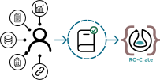

:earth_africa: **[This project is part of a larger open science and open data ecosystem. Find out more information here!](https://open-science.vliz.be/#projects)**

---

# Data management assistant

**Uniform and FAIR data management for scientists** \
:outbox_tray: Remove hassle of uploading meaningful research data \
:notebook: Safeguard rules to ensure uniformity within and between organizations \
:recycle: Streamline storage and access of research data

---

Data management assistant for Biodiversity Observation Networks (DMBON-assistant) is a case study of a more general data management framework and webtop application that supports scientists by providing a consistent and streamlined dataflow within and between individuals and organizations. 
It lowers the barrier for collaborative efforts by making data more accessible and searchable, enabling more complex search queries on open datasets that enrich meta-analyses.
The DMBON-assistant is an important piece of our grander [vision](#our-vision).

---

<!-- EXPLANATION OF OUR VISION -->
## Our vision
We believe that discovery relies on open and transparent management of data by following the [FAIR principles](https://www.go-fair.org/fair-principles/).
We furthermore believe that researchers should be able to search through scientific data just as easy as if they are performing a web-search.
This means that search queries such as *"what was the water temperature during recent sightings of killer whales in the North Pacific Ocean?"*, should be made possible. 
Obviously, for scientific data to be FAIR and meaningful to allow such queries, it has to adhere to specific rules such that others can discover, filter and (re-)use the data with little effort.
Ideally, tools should exist such that those that gather data should be able to upload and distribute meaningful data with relative ease. \
This project aims to do exactly that: assist people in uploading their data (including metadata) to the web. 
We believe that future projects, potentially built on top of this one, can then further support complex search queries on distributed datasets.

<figcaption> 
    <b>Fig. 1:</b>
    <i>A schematic overview of our vision: FAIR and distributed access to data and metadata using complex queries.
    (1.) A user uploads heterogeneous data using DMBON assistant. Our service first ensures the FAIR principle by packaging data in an RO-crate that contains the necessary metadata. Then another service generates miniature webpages from every individual RO-crate, which can be easily accessed using any browser to preview data.
    (2.) The distributed data lives on the web (e.g., using cloud services) and is summarized in a knowledge graph which can be queried using complex queries.
    (3.) When other users provide queries, the search engine summarizes the data that matches the query conveniently in a table to be used for analysis.
    </i>
</figcaption>

<!-- CLEARLY EXPLAIN WHO THIS PROJECT IS FOR -->
#### Who is it for?
This project is intended for academics, policy makers, and the general public. 
Academics are encouraged to share their research in a way that makes their research more meaningful and easily citable.
Policy makers benefit from this tool through lowering the barrier for extensive meta-analysis that can shed light on previously unreported correlations.
Finally, the general public benefits from such an open source tool by making academic research more easily accesible to the public.
We believe that open sourcing a project such as this benefits the community and with it we hope to advocate for future open science policies to come.

#### Goals
:heavy_check_mark: Introduce a simple assisted procedure for uploading heterogeneous data that conforms to FAIR data management plans. \
:heavy_check_mark: Enable complex search queries for meta-analysis on distributed, heterogeneous databases. \
:heavy_check_mark: Build a thriving community that supports open science.

### Motivation
Sound scientific results are derived from good data. 
While few people disagree with this statement, the current methods of both storing and accessing historical data are severely hampering novel scientific discoveries. 
On one end, data of published studies are permanently lost (Vines et al., [2014](https://doi.org/10.1016/j.cub.2013.11.014)) or researchers forget the details requires to make use of the data (Whitlock et al. [2010](https://doi.org/10.1086/650340)).
On the other end, losing access to data (and, importantly, their [metadata](#metadata)) makes it impossible to reproduce scientific results or perform critical meta-analyses.
Therefore, automated streamlining of data management plans (DMPs) is necessary for improving data preservation and accesibility.
DMBON-assistant is an open source webtop application designed to provide this automisation, thereby enabling consistent and streamlined data management.

##### Metadata: the overlooked critical component
One critical, but often overlooked, feature that greatly increases the longevity of datasets is [metadata](https://en.wikipedia.org/wiki/Metadata) (Leipzig et al. [2021](https://doi.org/10.1016/j.patter.2021.100322)), i.e. 'data that provides information about other data'. 
Metadata often encodes how to interpret the actual data, e.g. descriptions of meaning of columns in a table, and is thus often necessary for meta-analyses.
While sharing primary data is becoming increasingly more common (even though the process is not streamlined, see, e.g. Alsheikh-Ali et al., [2011](https://doi.org/10.1371/journal.pone.0024357) and Baker, [2015](https://doi.org/10.1038/533452a)), extensive efforts are often needed to gain access to metadata even when data is openly available (Tedersoo et al., [2021](https://doi.org/10.1038/s41597-021-00981-0)).
DMBON-assistant aims to alleviate this issue by assisting its users in providing the sufficient metadata that is needed to correctly interpret the data.

##### Why open source?
We are a small team and can only do so much.
Furthermore, we also cannot discover and fix all bugs and we can never cover all potential use cases and develop features for them. 
We are additionally huge advocates for open science and thus open source projects, such as this one. 
Therefore, we lay our hopes and trust with you, the community, to improve and further extend DMBON-assistant's functionality.
We welcome any and all suggestions, feedback, bug reports and general discussion on DMBON-assistant. \
If you are interested, please find the section on [contributing](#contributing) below!

---

## How does it work?
Interested? Great! 
But how does DMBON-assistant actually help those that gather data to upload and uplift their data in a meaningful way?
In general, the assistant (as the name suggests) aims to *assist* in the data upload process to ensure uniformity both within and between organizations. 
Our general envisioned flow is illustrated below:

<!-- FIGURE -- Schematic overview of the DMBON assistant -->

<figcaption align="left"><b>Fig. 2:</b>
    <i>A schematic overview of what the DMBON assistant aims to accomplish: easy and uniform uploading of heterogeneous datasets.
    </i>
</figcaption>

On the left, we see a user that has multiple sources of data and metadata. 
These can range from raw data and metadata to (source code to) analyses and publications. 
Importantly, much of the raw data is often uploaded to some external cloud service (such as [ENA](https://www.ebi.ac.uk/ena/browser/home) for DNA sequence information). 
As such, links to the raw data can be provided as well! 

DMBON assistant, here highlighted in blue, provides an easy way of uploading heterogeneous data using any browser!
Hidden under the hood, DMBON assistant ensures that the data description conforms to the data management plan of the organization.
Finally, the assistant generates a publishable [Research Object Crate (RO-crate)](https://www.researchobject.org/ro-crate/) that neatly packages heterogeneous research data with their metadata. 
Explain the general premise of DMBON-assistant

As such, using DMBON assistant greatly simplifies generation of FAIR research object crates by:
- providing an easy to use interface to upload research data using your browser
- ensuring correspondence with data management plans